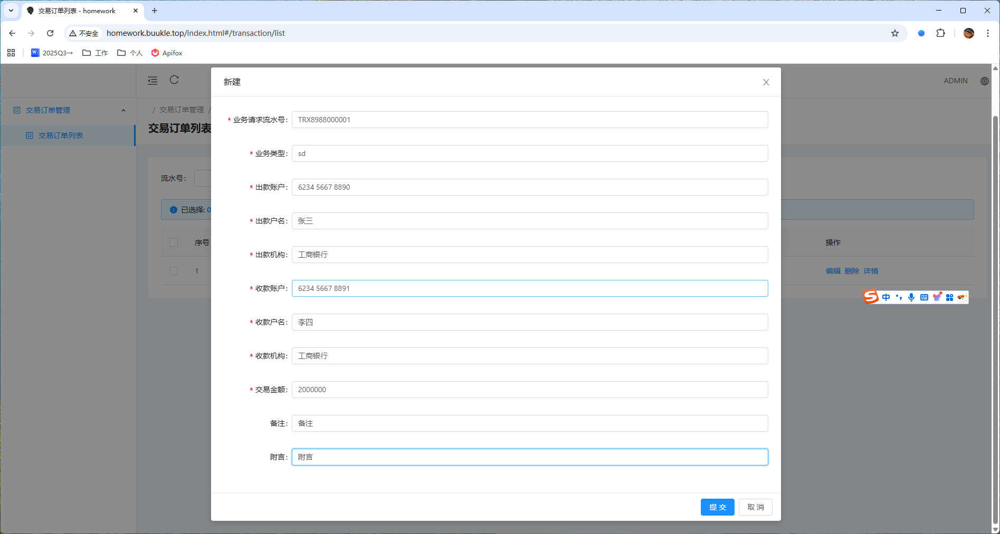
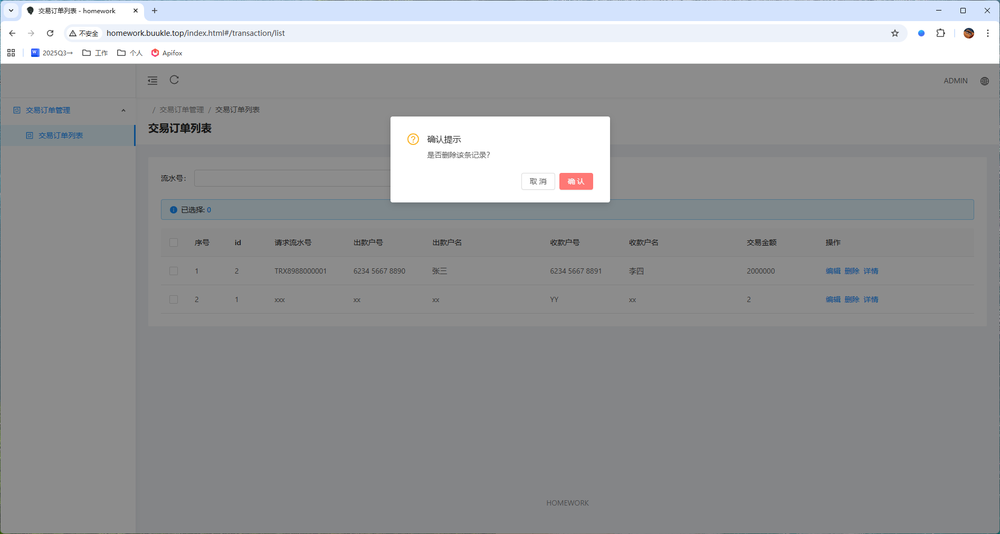
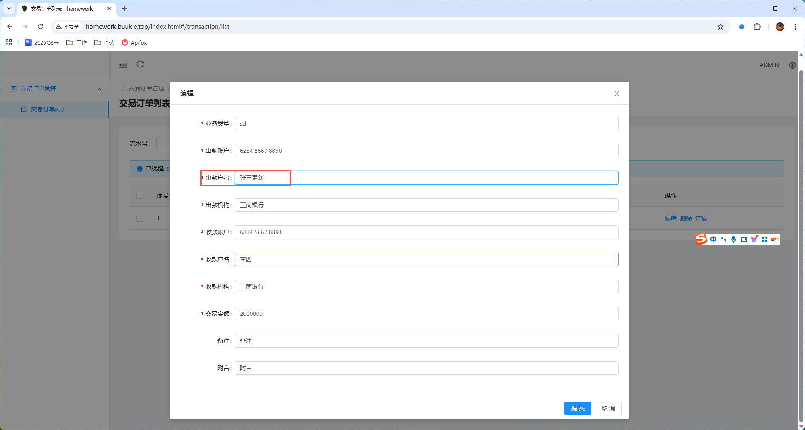

# transaction-management

# **交易订单管理系统**

## 系统简介

该项目目标是为银行交易提供基本的维护能力和扩展能力

### 线上预览

http://homework.buukle.top/index.html#/transaction/list

### 本地预览

本地启动 : transaction-management/transaction-management-backend/transaction-management-backend-web/src/main/java/homework.bank.web.WebApplication
`` 注 : 本地预览只需启动后端服务,前端资源已经构建并集成到了后端中 ``
访问路径: http://localhost:8080/index.html

### 本地开发

#### 前端 : transaction-management/transaction-management-frontend

##### 环境
node : v16.20.2
npm : 8.19.4
##### 调试步骤
在控制台进入仓库根目录,执行以下命令:
```sh
cd transaction-management-frontend
npm install
npm run serve
```
浏览器访问 127.0.0.1:8000/#/transaction/list 即可访问页面

#### 后端 : transaction-management/transaction-management-backend

##### 环境
jdk17
maven (默认使用.mvn机制,即使用.mvn下 : maven.config中的maven参数, wrapper/maven-wrapper.properties 的maven版本,settings.xml的maven仓库)

##### 调试步骤

(1) web服务

主要提供管理页面所需的web接口

- 启动

transaction-management/transaction-management-backend/transaction-management-backend-web模块下/src/main中主类

- 单元测试

transaction-management/transaction-management-backend/transaction-management-backend-web模块下/src/test中测试类

(2) job服务

transaction-management/transaction-management-backend/transaction-management-backend-job模块下/src/main中主类启动
主要提供资源消耗型任务所需服务(与其他服务隔离,避免影响web管理用户或交易主链路,任务中间件可插拔式在此模块集成)

(3) rpc服务

transaction-management/transaction-management-backend/transaction-management-backend-rpc模块下/src/main中主类启动
主要提供组织内部上游接口调用服务,可提供restful接口或sdk二方包(与其他服务隔离,考虑到后续发展与上游的业务进行服务端交互,提供rpc接口或其他形式的客户端)

### 容器部署(docker)

登录虚拟机服务器,执行一键部署脚本

```sh
./deploy.sh
```

一键容器化部署脚本,从拉取git代码,到构建镜像,再到替换docker容器,时间紧迫使用简易脚本实现,后续可基于此迁移到devops的pipline

deploy.sh:

```sh
#!/bin/bash

# 配置参数
REPO_URL="https://github.com/elvin-i/transaction-management"
PROJECT_DIR="transaction-management/transaction-management-backend"
IMAGE_NAME="transaction-backend"
IMAGE_TAG="1.0"
HOST_PORT=80
CONTAINER_PORT=8080

echo "Removing old project directory..."
rm -rf transaction-management/

echo "Cloning repository..."
git clone $REPO_URL

echo "Building Docker image..."
cd $PROJECT_DIR || exit 1
DOCKER_BUILDKIT=1 docker build -t $IMAGE_NAME:$IMAGE_TAG .

# 查找占用 HOST_PORT 的容器
OLD_CONTAINER=$(docker ps -q --filter "publish=$HOST_PORT")
if [ -n "$OLD_CONTAINER" ]; then
  echo "Stopping container using port $HOST_PORT..."
  docker stop $OLD_CONTAINER
  docker rm $OLD_CONTAINER
fi

echo "Starting new container..."
docker run -d -p $HOST_PORT:$CONTAINER_PORT $IMAGE_NAME:$IMAGE_TAG

echo "Deployment completed successfully."
```
   
## 设计方案

### 应用设计

采用微服务思想,根据领域对交易订单域进行深度思考和子域划分

### 技术设计

* 技术选型

java(jdk17)、SpringBoot、mybatis-plus、maven、H2、Docker、vue、ANTD(anti-design)

### 详细设计

#### 模块分层设计


采用高内聚,低耦合思想

纵向 : 将业务层和持久层内聚到公共模块 ,将 web , job , rpc 上层差异化进行模块化解耦 

横向 : 通过模块(transaction-management-backend-config)将  web , job , rpc 三者的异常处理 , 本地链路追踪(MDC) 等进行内聚处理

#### 数据模型设计
```
CREATE TABLE TRANSACTION_ORDER (
   ID BIGINT AUTO_INCREMENT PRIMARY KEY COMMENT '主键ID',
   REQUEST_NO VARCHAR(255) NOT NULL DEFAULT '' COMMENT '业务请求流水号,用于幂等',
   BUSINESS_TYPE VARCHAR(255) NOT NULL DEFAULT '' COMMENT '业务类型',
   PAYER_ACCOUNT_NO VARCHAR(255) NOT NULL DEFAULT '' COMMENT '出款方账户编号',
   PAYER_ACCOUNT_NAME VARCHAR(255) NOT NULL DEFAULT '' COMMENT '出款方账户名称',
   PAYER_ORG_CODE VARCHAR(255) NOT NULL DEFAULT '' COMMENT '出款方机构编码',
   PAYEE_ACCOUNT_NO VARCHAR(255) NOT NULL DEFAULT '' COMMENT '收款方账户编号',
   PAYEE_ACCOUNT_NAME VARCHAR(255) NOT NULL DEFAULT '' COMMENT '收款方账户名称',
   PAYEE_ORG_CODE VARCHAR(255) NOT NULL DEFAULT '' COMMENT '收款方机构编码',
   AMOUNT DECIMAL(19,2) NOT NULL DEFAULT 0 COMMENT '交易金额',
   REMARK VARCHAR(255) NOT NULL DEFAULT '' COMMENT '备注',
   POSTSCRIPT VARCHAR(255) NOT NULL DEFAULT '' COMMENT '附言',
   STATUS INT NOT NULL DEFAULT 0 COMMENT '状态',
   GMT_CREATED TIMESTAMP NOT NULL DEFAULT CURRENT_TIMESTAMP COMMENT '创建时间',
   GMT_UPDATED TIMESTAMP NOT NULL DEFAULT CURRENT_TIMESTAMP ON UPDATE CURRENT_TIMESTAMP COMMENT '更新时间',
   CONSTRAINT UK_REQUEST_NO UNIQUE (REQUEST_NO)
);
```
包含了交易订单常规的字段,预留状态字段便于状态机扩展
[schema.sql](transaction-management-backend/transaction-management-backend-dao/src/main/resources/schema.sql)
#### 接口设计

#### 交易管理API接口说明

**0. 通用规范**

  请求: 方法,参数遵循RESTful原则

  响应: 统一使用通用Result结构封装, 包含code,info,data,下文只展示data部分

**1. 创建交易订单接口**

- **请求方式**：GET
- **请求路径**：`/api/web/1.0/order`
- **请求参数**：
  - requestNo（必填）：业务请求流水号，用于幂等。
  - businessType（必填）：业务类型。
  - payerAccountNo（必填）：出款方账户编号。
  - payerAccountName（必填）：出款方账户名称。
  - payerOrgCode（必填）：出款方机构编码。
  - payeeAccountNo（必填）：收款方账户编号。
  - payeeAccountName（必填）：收款方账户名称。
  - payeeOrgCode（必填）：收款方机构编码。
  - amount（必填）：交易金额，必须大于等于0.01。
  - remark（可选）：备注。
  - postscript（可选）：附言。
- **响应内容**：
  - id：记录唯一标识。
  - requestNo：业务请求流水号，用于幂等。
  - businessType：业务类型。
  - payerAccountNo：出款方账户编号。
  - payerAccountName：出款方账户名称。
  - payerOrgCode：出款方机构编码。
  - payeeAccountNo：收款方账户编号。
  - payeeAccountName：收款方账户名称。
  - payeeOrgCode：收款方机构编码。
  - amount：交易金额。
  - status：交易状态。
  - remark：备注。
  - postscript：附言。
  - gmtCreated：创建时间。
  - gmtUpdated：更新时间。

**2. 删除交易订单接口**

- **请求方式**：GET
- **请求路径**：`/api/web/1.0/order/{id}`
- **请求参数**：
  路径参数
- **响应内容**：
  void

**3. 更新交易订单接口**

- **请求方式**：PUT
- **请求路径**：`/api/web/1.0/order/{id}`
- **请求参数**：
  - businessType（可选）：业务类型。
  - payerAccountNo（可选）：出款方账户编号。
  - payerAccountName（可选）：出款方账户名称。
  - payerOrgCode（可选）：出款方机构编码。
  - payeeAccountNo（可选）：收款方账户编号。
  - payeeAccountName（可选）：收款方账户名称。
  - payeeOrgCode（可选）：收款方机构编码。
  - amount（必填）：交易金额，必须大于等于0.01。
  - remark（可选）：备注。
  - postscript（可选）：附言。
- **响应内容**：
  - id：记录唯一标识。
  - requestNo：业务请求流水号，用于幂等。
  - businessType：业务类型。
  - payerAccountNo：出款方账户编号。
  - payerAccountName：出款方账户名称。
  - payerOrgCode：出款方机构编码。
  - payeeAccountNo：收款方账户编号。
  - payeeAccountName：收款方账户名称。
  - payeeOrgCode：收款方机构编码。
  - amount：交易金额。
  - status：交易状态。
  - remark：备注。
  - postscript：附言。
  - gmtCreated：创建时间。
  - gmtUpdated：更新时间。

**4. 查询交易订单-详情接口**

- **请求方式**：GET
- **请求路径**：`/api/web/1.0/order/{id}`
- **请求参数**：
  路径参数
- **响应内容**：
  - id：记录唯一标识。
  - requestNo：业务请求流水号，用于幂等。
  - businessType：业务类型。
  - payerAccountNo：出款方账户编号。
  - payerAccountName：出款方账户名称。
  - payerOrgCode：出款方机构编码。
  - payeeAccountNo：收款方账户编号。
  - payeeAccountName：收款方账户名称。
  - payeeOrgCode：收款方机构编码。
  - amount：交易金额。
  - status：交易状态。
  - remark：备注。
  - postscript：附言。
  - gmtCreated：创建时间。
  - gmtUpdated：更新时间。

**5. 查询交易订单-分页接口**

- **请求方式**：GET
- **请求路径**：`/api/web/1.0/order`
- **请求参数**：
  - pageNo（可选，默认值为0）：当前页码，用于分页显示交易记录。
  - pageSize（可选，默认值为10）：每页显示的交易记录数量。
  - startCreateTime（可选）：起始创建时间，用于筛选交易记录。
  - endCreateTime（可选）：结束创建时间，用于筛选交易记录。
  - requestNo（可选）：业务请求流水号，用于查询特定交易记录。
- **响应内容**：

  包含 :

  - records: 数据集合。
  - total: 总数量。
  - size: 页长。
  - current: 页码。
  
   其中,records的元素内容为:
  
  - id：记录唯一标识。
  - requestNo：业务请求流水号，用于幂等。
  - businessType：业务类型。
  - payerAccountNo：出款方账户编号。
  - payerAccountName：出款方账户名称。
  - payerOrgCode：出款方机构编码。
  - payeeAccountNo：收款方账户编号。
  - payeeAccountName：收款方账户名称。
  - payeeOrgCode：收款方机构编码。
  - amount：交易金额。
  - status：交易状态。
  - remark：备注。
  - postscript：附言。
  - gmtCreated：创建时间。
  - gmtUpdated：更新时间。

#### 参数校验

    使用spring-boot-starter-validation进行参数校验，对异常信息进行了统一处理和封装返回。

#### 异常

    自定义服务异常(ServiceException.java)，统一封装业务异常。
    自定义全局异常处理器(GlobalExceptionHandler.java)，使用http响应码,自定义code异常码,自定义info返回信息,自定义data返回数据,与前端进行标准化交互。

### 资金安全设计

#### 幂等设计

  ``` sql
       CONSTRAINT UK_REQUEST_NO UNIQUE (REQUEST_NO)
  ```
请求流水号使用唯一索引,在重复请求时,幂等返回相同的数据,防止同一请求流水号重复下单造成资金安全隐患

### 性能考量
#### 本地缓存

* 使用Caffeine作为缓存管理器,有效保护高频查询对持久层的访问压力

## 测试方案

### 单元测试

### 集成测试

### 性能测试

## 功能展示

* 新增交易
  
  新增后
  
* 删除交易
  
  删除后
  
* 更新交易
  
  更新后
  
* 查询交易 - 分页
  第一页 
  
  第二页
  
* 查询交易 - 详情
  
## 现状及规划

### 现状

### 规划

